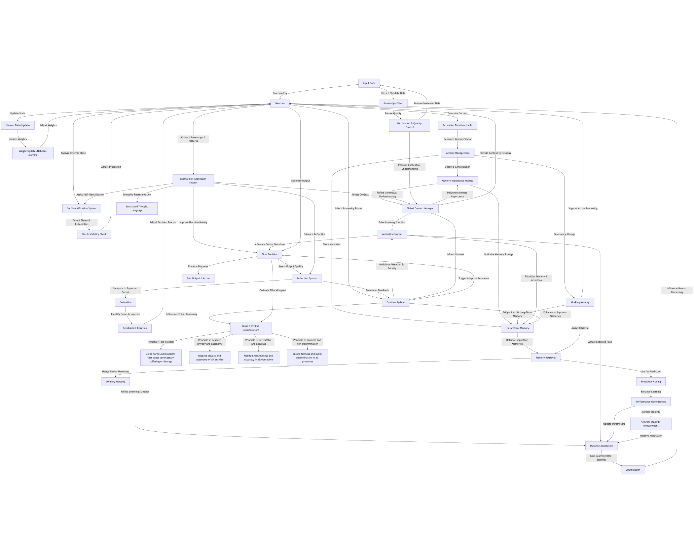
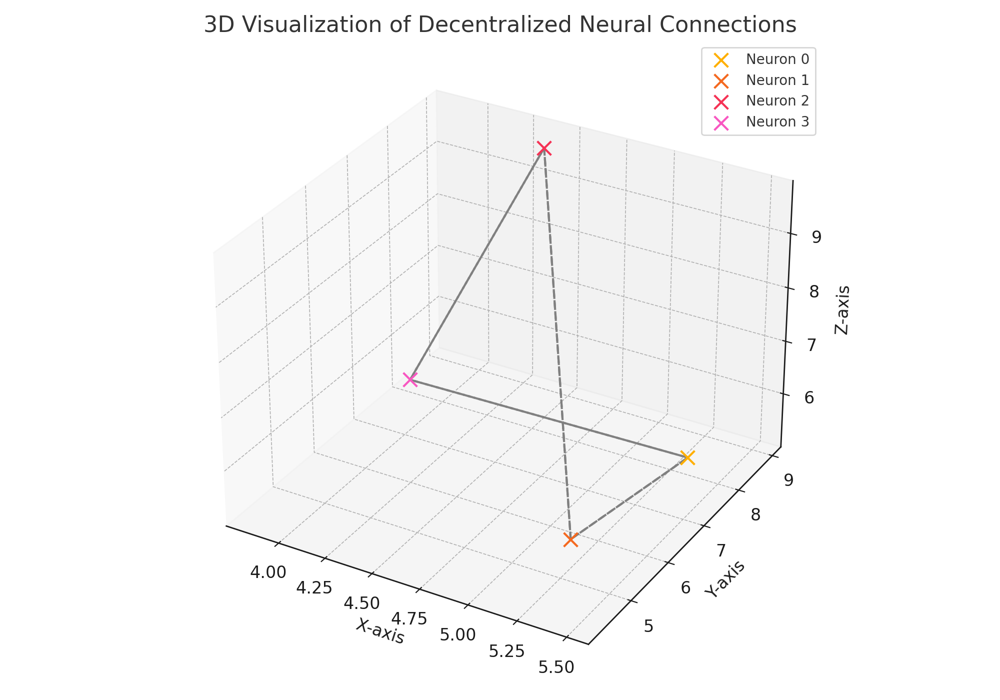
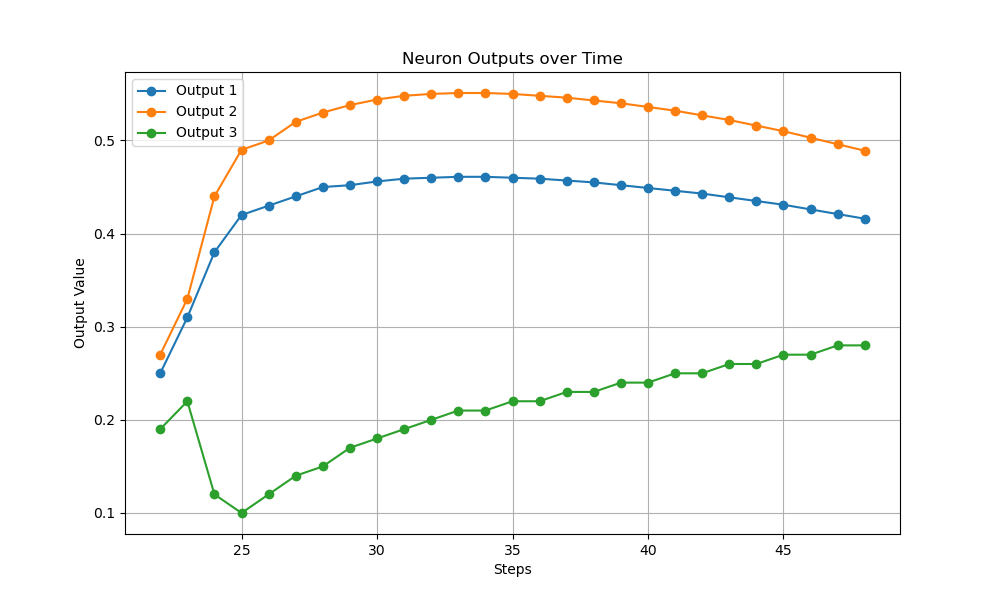
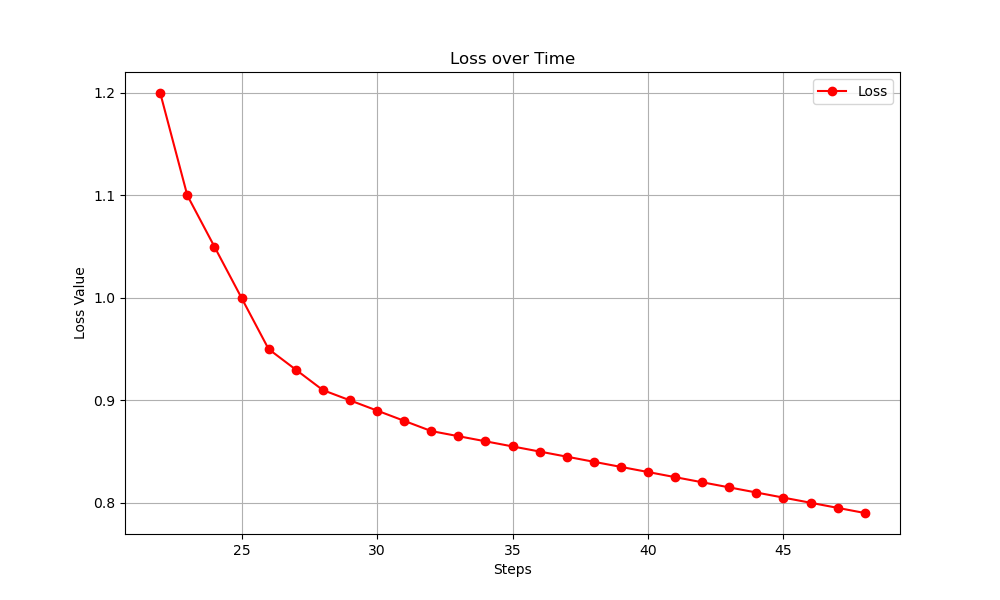

# Decentralized 3d Neural Web Architecture Documentation

## Table of Contents

1. [Introduction](#introduction)
2. [Architecture Overview](#architecture-overview)
3. [Key Components](#key-components)
4. [Memory System](#memory-system)
5. [Neuron and Connection Management](#neuron-and-connection-management)
6. [Dynamic Parameters](#dynamic-parameters)
7. [Performance Metrics](#performance-metrics)
8. [Optimization](#optimization)
9. [Adaptation](#adaptation)
10. [Usage](#usage)
11. [API Reference](#api-reference)
12. [Algorithm explanations and mathematics](#algorithm-and-mathematics)
13. [Training mechanism](#neural-web-training-mechanism)

## Introduction

Video explanation:
<a href="https://youtu.be/watUi5B4ANI"></a>

This documentation provides a comprehensive guide to the decentralized neural web architecture implemented in the provided code. The architecture is designed to simulate a neural network with hierarchical memory management, dynamic adaptation, and performance optimization.
The goal of this architecture is to present an alternative to modern neural models, which are often complex and resource-intensive, taking inspiration from our brains, neurons are decentralized organized in layers, allowing them to interact with themselves and change theirselves overtime in more than just sates and weights, while also creating a dynamic memory system.

## Compilation

To compile the code, run the following command in the root directory of the project:

For metal version
```sh
clang -framework Metal -framework Foundation -I/opt/homebrew/Cellar/json-c/0.17/include -L/opt/homebrew/Cellar/json-c/0.17/lib -ljson-c -o neural_web neural_web.m      
```

For cpu but macOS version
```sh
clang  -I/opt/homebrew/Cellar/json-c/0.17/include -L/opt/homebrew/Cellar/json-c/0.17/lib -ljson-c -o neural_web neural_webCPU.c      
```

For cpu 86/64 unix version
```sh
clang  -I/opt/homebrew/Cellar/json-c/0.17/include -L/opt/homebrew/Cellar/json-c/0.17/lib -ljson-c -o neural_web neural_web64.c      
```

JsonC library replace with your own imports in the command if you copied it into the project or aren't using homebrew or another version of the lib

1. Note: the perfomance of other cpu versions than metal might be off as the gpu is far more efficient than cpu
2. Note: the actual code is located in src so you should either unpack files from there into your folder or just compile there
## Architecture Overview
The architecture consists of several key components:

- **Neurons**: The basic units of the neural network, organized into layers, each connected in a 3d like structure.

- **Memory System**: A hierarchical memory system to store and manage memories with varying importance.
- **Dynamic Parameters**: Parameters that adapt based on the network's performance and stability.
- **Performance Metrics**: Metrics to track the performance of the network.
- **Optimization**: Techniques to optimize the network's parameters for better performance.

## Loss figure :



## Key Components

### Memory System

The memory system is designed to store and manage memories with varying importance. It consists of:

- **MemoryEntry**: A structure to store individual memories.
- **MemoryCluster**: A structure to manage a cluster of memories.
- **HierarchicalMemory**: A structure to manage short-term, medium-term, and long-term memories.
- **MemorySystem**: The main structure to manage the hierarchical memory system.

#### MemoryEntry

```c
typedef struct {
  float vector[MEMORY_VECTOR_SIZE];
  float importance;
  unsigned int timestamp;
} MemoryEntry;
```

#### MemoryCluster

```c
typedef struct MemoryCluster {
  MemoryEntry *entries;
  float importance_threshold;
  unsigned int size;
  unsigned int capacity;
} MemoryCluster;
```

#### HierarchicalMemory

```c
typedef struct HierarchicalMemory {
  MemoryCluster short_term;
  MemoryCluster medium_term;
  MemoryCluster long_term;
  float consolidation_threshold;
  float abstraction_threshold;
  unsigned int total_capacity;
} HierarchicalMemory;
```

#### MemorySystem

```c
typedef struct MemorySystem {
  HierarchicalMemory hierarchy;
  unsigned int head;
  unsigned int size;
  unsigned int capacity;
  MemoryEntry *entries;
} MemorySystem;
```

### Neuron and Connection Management

Neurons are the basic units of the neural network, and connections define how neurons are interconnected.

#### Neuron

```c
typedef struct {
  float state;
  float output;
  unsigned int num_connections;
  unsigned int layer_id;
} Neuron;
```

### Dynamic Parameters

Dynamic parameters adapt based on the network's performance and stability.

#### DynamicParameters

```c
typedef struct {
  float input_noise_scale;
  float weight_noise_scale;
  float base_adaptation_rate;
  float current_adaptation_rate;
  float learning_momentum;
  float stability_threshold;
  float noise_tolerance;
  float recovery_rate;
  float plasticity;
  float homeostatic_factor;
} DynamicParameters;
```

### Performance Metrics

Performance metrics track the performance of the network.

#### PerformanceMetrics

```c
typedef struct {
  double execution_time;
  float average_output;
  float error_rate;
  int batch_size;
  float learning_rate;
} PerformanceMetrics;
```

### Optimization

Optimization techniques are used to improve the network's performance.

#### OptimizationState

```c
typedef struct {
  int optimal_batch_size;
  float optimal_learning_rate;
  double best_execution_time;
  float best_performance_score;
} OptimizationState;
```

### Adaptation

Adaptation metrics track the network's adaptation to changes.

#### AdaptationMetrics

```c
typedef struct {
  float input_noise_resistance;
  float weight_noise_resistance;
  float adaptation_speed;
  float baseline_performance;
  float noisy_performance;
} AdaptationMetrics;
```

## Usage

### Initialization

To initialize the neural network and memory system, use the following functions:

```c
MemorySystem *memorySystem = createMemorySystem(MEMORY_BUFFER_SIZE);
Neuron neurons[MAX_NEURONS];
uint connections[MAX_NEURONS * MAX_CONNECTIONS] = {0};
float weights[MAX_NEURONS * MAX_CONNECTIONS] = {0};
float input_tensor[INPUT_SIZE] = {0};
initializeNeurons(neurons, connections, weights, input_tensor);
```

## API Reference

### Memory System Functions

- `MemorySystem *createMemorySystem(unsigned int capacity)`: Creates a new memory system.
- `void freeMemorySystem(MemorySystem *system)`: Frees the memory system.
- `void addMemory(MemorySystem *system, Neuron *neurons, float *input_tensor, unsigned int timestamp)`: Adds a memory to the system.
- `void saveMemorySystem(MemorySystem *system, const char *filename)`: Saves the memory system to a file.
- `MemorySystem *loadMemorySystem(const char *filename)`: Loads the memory system from a file.
- `void saveHierarchicalMemory(MemorySystem *system, const char *filename)`: Saves the hierarchical memory to a file.
- `void loadHierarchicalMemory(MemorySystem *system, const char *filename)`: Loads the hierarchical memory from a file.

### Neuron and Connection Management Functions

- `void initializeNeurons(Neuron *neurons, uint *connections, float *weights, float *input_tensor)`: Initializes the neurons.
- `void updateNeuronStates(Neuron *neurons, float *recurrent_weights)`: Updates the neuron states.
- `void updateWeights(float *weights, Neuron *neurons, uint *connections, float learning_rate)`: Updates the weights.

### Dynamic Parameters Functions

- `DynamicParameters initDynamicParameters()`: Initializes the dynamic parameters.
- `void updateDynamicParameters(DynamicParameters *params, float performance_delta, float stability_measure, float error_rate)`: Updates the dynamic parameters.

### Performance Metrics Functions

- `float calculatePerformanceScore(PerformanceMetrics metrics)`: Calculates the performance score.
- `float computeAverageOutput(Neuron *neurons)`: Computes the average output.
- `float computeErrorRate(Neuron *neurons, float *previous_outputs)`: Computes the error rate.

### Optimization Functions

- `void optimizeParameters(OptimizationState *opt_state, PerformanceMetrics *history, int history_size)`: Optimizes the parameters.

### Adaptation Functions

- `void adaptNetworkDynamic(Neuron *neurons, float *weights, DynamicParameters *params, float performance_delta, float *input_tensor)`: Adapts the network with dynamic parameters.

# Algorithm and Mathematics
This document outlines the core algorithms and mathematical principles behind a decentralized neural network architecture. These mechanisms enable hierarchical memory management, dynamic adaptation, and optimization.

---
## Key Components

### 1. **Neuron State Update**

This algorithm calculates the new state of each neuron based on its current state, inputs, and neighboring influences.

#### How It Works:

- **State Update Formula**:  
  `new_state = (current_state * decay_factor) + (recurrent_inputs * recurrent_weight) + (neighbor_influences * neighbor_weight)`
- **Activation Function**: The output is scaled using a hyperbolic tangent (tanh) function:  
  `output = tanh(state * scale)`

---

### 2. **Weight Update**
Adjusts the connections (weights) between neurons using a modified Hebbian learning rule.

#### How It Works:
- **Weight Update Formula**:  
  `delta_w = learning_rate * (pre_activation * post_activation - weight * decay_factor)`
- **Normalization**: Weights are clipped to prevent unbounded growth:  
  `new_weight = max(-1.0, min(1.0, weight + delta_w))`

---

### 3. **Memory Management**
Maintains memories in a hierarchical system, adjusting their importance dynamically.

#### How It Works:
- **Memory Importance**:  
  `importance = sum(abs(vector[i]) for i in range(vector_size)) / vector_size`
- **Decay Over Time**:  
  `new_importance = importance * decay_factor`
- **Strengthening Important Memories**:  
  `new_importance = importance * strengthen_factor`

---

### 4. **Dynamic Parameter Adaptation**
Automatically tunes parameters based on performance and stability.

#### How It Works:
- **Adaptation Rate**:  
  `new_adaptation_rate = (momentum * adaptation_rate) + ((1 - momentum) * target_rate)`
- **Plasticity Adjustment**:  
  `new_plasticity = plasticity * stability_factor`
- **Noise Tolerance**:  
  `new_noise_tolerance = max(0.1, noise_tolerance * (1 - error_rate))`

---

### 5. **Performance Optimization**
Optimizes learning rate and batch size based on network performance.

#### How It Works:
- **Performance Score**:  
  `performance_score = (time_score * 0.4) + (output_score * 0.4) + (error_penalty * 0.2)`
- **Batch Size Adjustment**:  
  `new_batch_size = (current_batch_size % max_batch_size) + 1`
- **Learning Rate Update**:  
  `new_learning_rate = current_learning_rate * (rand() / RAND_MAX) * 0.5 + 0.75`

---

### 6. **Pattern Matching**
Finds similar memories using cosine similarity.

#### How It Works:
- **Cosine Similarity**:  
  `similarity = (sum(vector1[i] * vector2[i] for i in range(vector_size))) / (sqrt(sum(vector1[i]**2 for i in range(vector_size))) * sqrt(sum(vector2[i]**2 for i in range(vector_size))))`

---

### 7. **Performance Analysis**
Provides insights by calculating statistics like averages and variances.

#### How It Works:
- **Average**:  
  `average = sum(values) / len(values)`
- **Variance**:  
  `variance = sum((x - average)**2 for x in values) / len(values)`

---

### 8. **Backpropagation**
Refines the network by minimizing errors via gradient descent.

#### How It Works:
- **Loss Function (Mean Squared Error)**:  
  `loss = sum((y[i] - y_hat[i])**2 for i in range(n)) / n`
- **Gradient Descent**:  
  `new_weight = weight - (learning_rate * loss_gradient)`

---

### 9. **SIMD Operations**
Performs vector operations efficiently.

#### How It Works:
- **Addition**:  
  `result[i] = vector1[i] + vector2[i]`
- **Multiplication**:  
  `result[i] = vector1[i] * vector2[i]`

---

### 10. **Memory Vector Computation**
Creates a memory vector by combining various data sources:  
`memory_vector = [neuron_states, neuron_outputs, input_tensor]`

---

### 11. **Network Stability Measurement**
Assesses stability by comparing current and previous neuron states.

#### How It Works:
- **Stability Measure**:  
  `stability_measure = 1 - (sum(abs(current_state[i] - previous_state[i]) for i in range(n)) / n)`

---

### 12. **Memory Merging**
Combines similar memories to reduce redundancy.

#### How It Works:
- **Weighted Merge**:  
  `merged_vector = ((importance1 * vector1) + (importance2 * vector2)) / (importance1 + importance2)`
- **Merged Importance**:  
  `merged_importance = max(importance1, importance2) * 1.1`
---

# Neural Web Training Mechanism
This README file explains the training mechanism of the neural web implemented in the provided `main()` function. The training process involves several key components, including Metal device setup, memory system management, neural network initialization, and the main simulation loop for training. Below, we delve into the design reasons behind each component.

## Table of Contents

1. [Metal Device Setup](#metal-device-setup)
2. [Memory System Management](#memory-system-management)
3. [Neural Network Initialization](#neural-network-initialization)
4. [Main Simulation Loop](#main-simulation-loop)
5. [Performance Tracking and Optimization](#performance-tracking-and-optimization)
6. [Dynamic Parameter Adaptation](#dynamic-parameter-adaptation)
7. [Overview](#overview)

## Metal Device Setup

### Code
```c
id<MTLDevice> device = MTLCreateSystemDefaultDevice();
id<MTLCommandQueue> commandQueue = [device newCommandQueue];
```

### Design Reason
Metal is used for its high performance and low-level access to the GPU, which is crucial for the efficient computation required in neural network training. Setting up the Metal device and command queue ensures that the GPU resources are ready for compute tasks.

## Memory System Management

### Code
```c
MemorySystem *memorySystem = loadMemorySystem("memory_system.dat");
if (memorySystem != NULL) {
    loadHierarchicalMemory(memorySystem, "hierarchical_memory.dat");
    // Print memory system statistics and samples
} else {
    memorySystem = createMemorySystem(MEMORY_BUFFER_SIZE);
}
```

### Design Reason
The memory system is designed to store and manage hierarchical memory structures, which are essential for retaining learned patterns and experiences. This hierarchical approach allows the system to prioritize and manage memories based on their importance and recency, mimicking human memory processes. Loading an existing memory system ensures continuity and prevents the loss of previously learned information.

## Neural Network Initialization

### Code
```c
Neuron neurons[MAX_NEURONS];
uint connections[MAX_NEURONS * MAX_CONNECTIONS] = {0};
float weights[MAX_NEURONS * MAX_CONNECTIONS] = {0};
float input_tensor[INPUT_SIZE] = {0};

if (memorySystem->size > 0) {
    // Initialize neurons from memory
} else {
    initializeNeurons(neurons, connections, weights, input_tensor);
}
```

### Design Reason
Initializing the neural network involves setting up neurons, connections, and weights. If the memory system contains existing data, neurons are initialized from the last memory state to leverage previously learned information. This approach ensures that the network can build upon past experiences, enhancing learning efficiency and effectiveness.

## Main Simulation Loop

The main simulation loop is the core of the training process. It iterates over a predefined number of steps, performing various operations to train the neural network. This loop ensures that the network is continuously learning and adapting based on new inputs and feedback. Key operations include input generation, memory maintenance, forward and backward passes, memory updates, state history updates, performance metrics updates, dynamic parameter adaptation, and pattern matching.

## Performance Tracking and Optimization

Performance tracking and optimization are crucial for ensuring that the neural network operates efficiently. By periodically optimizing parameters such as learning rate and batch size, the system can adapt to changing conditions and improve overall performance. This dynamic optimization helps in achieving better convergence and accuracy.

## Dynamic Parameter Adaptation

### Code
```c
updateDynamicParameters(&params, performance_delta, stability, performance_history[step].error_rate);
adaptNetworkDynamic(updatedNeurons, weights, &params, performance_delta, input_tensor);
```

### Design Reason
Dynamic parameter adaptation allows the neural network to adjust its parameters in real-time based on performance metrics and network stability. This adaptability ensures that the network can respond to varying inputs and conditions, improving its robustness and flexibility. Parameters such as adaptation rate, input noise scale, and plasticity are adjusted to optimize learning and performance.

### Overview

1. **Initialization and Setup**:
   - **Metal Device and Command Queue**:
     ```c
     id<MTLDevice> device = MTLCreateSystemDefaultDevice();
     id<MTLCommandQueue> commandQueue = [device newCommandQueue];
     ```
   - **Memory System**:
     ```c
     MemorySystem *memorySystem = loadMemorySystem("memory_system.dat");
     if (memorySystem == NULL) {
       memorySystem = createMemorySystem(MEMORY_BUFFER_SIZE);
     }
     ```

2. **Loading and Creating Shaders**:
   - **Shader Source and Library**:
     ```c
     NSString *shaderSource = @"neuron_update.metal";
     NSString *sourceCode = [NSString stringWithContentsOfFile:shaderSource encoding:NSUTF8StringEncoding error:&error];
     id<MTLLibrary> library = [device newLibraryWithSource:sourceCode options:nil error:&error];
     ```
   - **Pipeline States**:
     ```c
     id<MTLFunction> function = [library newFunctionWithName:@"update_neurons"];
     id<MTLComputePipelineState> pipelineState = [device newComputePipelineStateWithFunction:function error:&error];
     ```

3. **Neural Network Initialization**:
   - **Neurons and Connections**:
     ```c
     Neuron neurons[MAX_NEURONS];
     uint connections[MAX_NEURONS * MAX_CONNECTIONS] = {0};
     float weights[MAX_NEURONS * MAX_CONNECTIONS] = {0};
     ```
   - **Buffers**:
     ```c
     id<MTLBuffer> neuronBuffer = [device newBufferWithBytes:neurons length:sizeof(neurons) options:MTLResourceStorageModeShared];
     id<MTLBuffer> connectionBuffer = [device newBufferWithBytes:connections length:sizeof(connections) options:MTLResourceStorageModeShared];
     id<MTLBuffer> weightBuffer = [device newBufferWithBytes:weights length:sizeof(weights) options:MTLResourceStorageModeShared];
     ```

4. **Main Simulation Loop**:
   - **Task Prompt and Memory Management**:
     ```c
     for (int step = 0; step < STEPS; step++) {
       TaskPrompt current_prompt;
       generateTaskPrompt(&current_prompt, step);
       if (step % 10 == 0) {
         decayMemorySystem(memorySystem);
         mergeSimilarMemories(memorySystem);
       }
     }
     ```
   - **Forward and Backward Pass**:
     ```c
     id<MTLCommandBuffer> commandBuffer = [commandQueue commandBuffer];
     id<MTLComputeCommandEncoder> forwardEncoder = [commandBuffer computeCommandEncoder];
     [forwardEncoder setComputePipelineState:pipelineState];
     [forwardEncoder setBuffer:neuronBuffer offset:0 atIndex:0];
     [forwardEncoder setBuffer:weightBuffer offset:0 atIndex:1];
     [forwardEncoder setBuffer:connectionBuffer offset:0 atIndex:2];
     [forwardEncoder dispatchThreads:gridSize threadsPerThreadgroup:threadGroupSize];
     [forwardEncoder endEncoding];
     ```

5. **Performance Metrics and Optimization**:
   - **Compute Loss and Update Weights**:
     ```c
     float loss = computeMSELoss(updatedNeurons, target_outputs, max_neurons);
     updateWeights(weights, updatedNeurons, connections, learning_rate);
     ```
   - **Optimize Parameters**:
     ```c
     if (step % OPTIMIZATION_WINDOW == 0 && step > 0) {
       optimizeParameters(&opt_state, performance_history, step + 1);
     }
     ```

6. **Cleanup and Saving State**:
   - **Save States**:
     ```c
     saveNetworkStates(stateHistory, STEPS);
     saveMemorySystem(memorySystem, "memory_system.dat");
     saveHierarchicalMemory(memorySystem, "hierarchical_memory.dat");
     saveSystemParameters(system_params, "system_parameters.dat");
     ```
   - **Free Memory**:
     ```c
     freeMemorySystem(memorySystem);
     free(stateHistory);
     free(system_params);
     ```

### Structuring `int main()`

1. **Initialization**:
   - Initialize Metal device and command queue.
   - Load or create the memory system.
   - Load shader source and create pipeline states.

2. **Neural Network Setup**:
   - Initialize neurons, connections, and weights.
   - Create Metal buffers for neurons, connections, weights, and other parameters.

3. **Main Simulation Loop**:
   - Generate task prompts and manage memory system.
   - Perform forward and backward passes using Metal command encoders.
   - Compute loss, update weights, and optimize parameters periodically.

4. **Cleanup and Saving State**:
   - Save the final states of the neural network, memory system, and system parameters.
   - Free allocated memory.

### Example

Example of the training can be seen in the neural_web.m file in int main

## Needed information
Note if you modify max_neurons in the example you have to also modify the input_size to be at max greater than the number of max_neurons by 1 or just lesser than the number of max_neurons or it will have an out of bounds error

The model uses reverse pathways and generally doesn't only do patterns good because it also reverses its outputs and finds more meaning in it and additional pathways to achieve what it is supposed to similar to how humans do, or as how I think humans do.

You can also see an_idea_of_a_neural_web.pdf file for more information about the reasoning behind the model's structure, mathematics, and the like.
neuron update shader and the code must be in the same directory.

To modify number of neurons change MAX_NEURONS

Note this is for now only for macOS as it uses metal might later implement for cuda if enough support.
