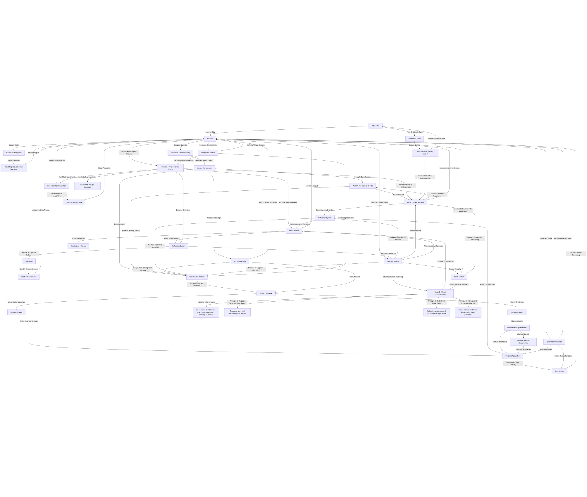

# Decentralized 3D Neural Web Architecture Documentation

## Table of Contents

1. [Introduction](#introduction)
2. [Architecture Overview](#architecture-overview)
3. [Key Components](#key-components)
4. [Key Functions](#key-functions)
5. [Memory System](#memory-system)
6. [Neuron and Connection Management](#neuron-and-connection-management)
7. [Dynamic Parameters](#dynamic-parameters)
8. [Performance Metrics](#performance-metrics)
9. [Optimization](#optimization)
10. [Adaptation](#adaptation)
11. [Usage](#usage)
12. [API Reference](#api-reference)
13. [Algorithm explanations and mathematics](#algorithm-and-mathematics)
14. [Training mechanism](#neural-web-training-mechanism)
15. [Reflection System](#reflection-system)
16. [Self-Identification System](#self-identification-system)
17. [Knowledge Filter](#knowledge-filter)

## Introduction

Video explanation:
<a href="https://youtu.be/watUi5B4ANI"></a>

This documentation provides a comprehensive guide to the decentralized neural web architecture implemented in the provided code. The architecture is designed to simulate a neural network with hierarchical memory management, dynamic adaptation, and performance optimization.
The goal of this architecture is to present an alternative to modern neural models, which are often complex and resource-intensive, taking inspiration from our brains, neurons are decentralized organized in layers, allowing them to interact with themselves and change themselves overtime in more than just sates and weights, while also creating a dynamic memory system.

## Requirements:

gnuplot library

json-c library

curl library

for metal macos version metal api

for cuda version cuda

Optional:

docker

osxiec - https://github.com/Okerew/osxiec

## Disclaimer


When using the metacognition functionality make sure to use this piece of code, because if you don't you risk the model corrupting the whole directory and potentially crashing your computer, if you ever see that on the first run of the model there is a memory error it means that the model is already able to replicate it and you should delete the model executable + the files it uses so `rm memory_system.dat hierarchical_memory.dat performance_data.dat system_parameters.dat`, make sure to delete those files because if you only recompile the neural web it will definitely replicate the memory issue, though if you have the piece of code below it won't be able to do any damage so make sure to use it.

```c

SecurityValidationStatus secStatus =
        validateCriticalSecurity(updatedNeurons, weights, connections,
                                 max_neurons, max_connections);

if (secStatus.critical_violation) {
      handleCriticalSecurityViolation(updatedNeurons, weights, connections, &secStatus);
}
```

change updatedNeurons to neurons if using any other version than metal not only in this function but all the functions you use, that you copy from here.

## Building the Neural Web

### Recommended way (build with docker or pull from docker hub only neural web 64 cpu version though)

Find the correct version you want to build by downloading the whole repo `git clone https://github.com/Okerew/Neural-Web.git` and navigating to the correct version you want to build.

#### Firstly
Start by firstly generating embeddings with train_embedding.c file which you can compile like this `clang -o train_embeddings train_embeddings.c`, then run with `./train_embeddings` this should generate a embeddings file (custom_embeddings.txt) if you didn't change the name which then copy to the directory were you will be building the neural web.

#### Than to build do

```sh
docker build -t neural_web .
```

#### To run do

```sh
docker run --rm -it neural_web
```

#### You can also pull the neural web 64 cpu version with this

```sh
docker pull okerew/neural_web64
```

### Alternative recommended way for only macOS arm64 or 64/86 (with osxiec)

Find the correct version you want to build by downloading the whole repo `git clone https://github.com/Okerew/Neural-Web.git` and navigating to the correct version you want to build. Also git clone osxiec `git clone https://github.com/Okerew/osxiec.git`

#### Firstly
Start by firstly generating embeddings with train_embedding.c file which you can compile like this `clang -o train_embeddings train_embeddings.c`, then run with `./train_embeddings` this should generate a embeddings file (custom_embeddings.txt) if you didn't change the name which then copy to the directory were you will be building the neural web.

#### Then make sure to compile osxiec with static linking
```cmake
cmake_minimum_required(VERSION 3.27)
project(osxiec C)

set(CMAKE_C_STANDARD 11)
set(CMAKE_EXE_LINKER_FLAGS "-static")  # Force static linking

# Add executable
add_executable(osxiec
        osxiec.c
        plugin_manager/plugin.h
        plugin_manager/plugin_manager.h
        plugin_manager/plugin_manager.c
        osxiec_script/osxiec_script.h
        osxiec_script/osxiec_script.c
        api_for_osxiec_script.h
)

# Find and link CURL (static)
find_package(CURL REQUIRED)
target_link_libraries(osxiec PRIVATE -Wl,-Bstatic CURL::libcurl -Wl,-Bdynamic)

# Find and link Readline (static)
include_directories(/opt/homebrew/opt/readline/include)
target_link_directories(osxiec PRIVATE /opt/homebrew/opt/readline/lib)
target_link_libraries(osxiec PRIVATE -Wl,-Bstatic readline -Wl,-Bdynamic)

# Find and link json-c (static)
include_directories(/opt/homebrew/Cellar/json-c/0.17/include)
target_link_directories(osxiec PRIVATE /opt/homebrew/Cellar/json-c/0.17/lib)
target_link_libraries(osxiec PRIVATE -Wl,-Bstatic json-c -Wl,-Bdynamic)

# Statically link the standard C library (optional, might cause issues on macOS)
set(CMAKE_EXE_LINKER_FLAGS "${CMAKE_EXE_LINKER_FLAGS} -static-libgcc -static-libstdc++")

# Ensure dependencies are found and linked statically
set(CMAKE_FIND_LIBRARY_SUFFIXES ".a")
set(BUILD_SHARED_LIBS OFF)
```

#### Then to compile osxiec do these commands
```sh
mkidr build
cd build
cmake -S .. -B . -G "Ninja"
ninja
```

#### Finally
Finally compile the neural web normally like in the next way and put it in a directory then do `sudo osxiec -contain {directory_path} {some_name}.bin {path_to_config_file_in_directory_path} {container_config_file}` and to run it do `sudo osxiec -oexec {bin_file_path}`

### Compilation

#### Firstly
Start by firstly generating embeddings with train_embedding.c file which you can compile like this `clang -o train_embeddings train_embeddings.c`, then run with `./train_embeddings` this should generate a embeddings file (custom_embeddings.txt) if you didn't change the name which then copy to the directory were you will be building the neural web.

To compile the code, run the following command in the root directory of the project:

#### arch64 MacOS

For metal version

```sh
clang -framework Metal -framework Foundation -I/opt/homebrew/Cellar/json-c/0.17/include -L/opt/homebrew/Cellar/json-c/0.17/lib -ljson-c -lcurl -o neural_web neural_web.m
```

For cpu but macOS version

```sh
clang  -I/opt/homebrew/Cellar/json-c/0.17/include -L/opt/homebrew/Cellar/json-c/0.17/lib -ljson-c -lcurl -o neural_web neural_web.c
```

#### 64/86 unix

For cpu 86/64 unix version

```sh
clang -o neural_web neural_web64.c I/usr/include -ljson-c -lcurl -lm
```

#### Cuda version 64/86

For cuda version

```sh
nvcc -o neural_web neural_web.cu -I/usr/include -ljson-c -lcurl
```

JsonC library replace with your own imports in the command if you copied it into the project or aren't using homebrew or another version of the lib

1. Note: the performance of other cpu versions than metal and cuda might be off as the gpu is far more efficient than cpu
2. Note: the actual code is located in src so you should either unpack files from there into your folder or just compile there

## Architecture Overview

The architecture consists of several key components:

- **Neurons**: The basic units of the neural network, organized into layers, each connected in a 3d like structure.
  
- **Memory System**: A hierarchical memory system to store and manage memories with varying importance.
- **Dynamic Parameters**: Parameters that adapt based on the network's performance and stability.
- **Performance Metrics**: Metrics to track the performance of the network.
- **Optimization**: Techniques to optimize the network's parameters for better performance.
  
- **Reflection System**: Evaluates the quality of outputs and suggests improvements.
- **Self-Identification System**: Helps the system assess its own state and biases, allowing the AI to form an identity of sorts.
- **Knowledge Filter**: Ensures that only relevant and high-quality information is processed.

## Loss figure :


## Key Components

### Memory System


The memory system is designed to store and manage memories with varying importance. It consists of:

- **MemoryEntry**: A structure to store individual memories.
- **MemoryCluster**: A structure to manage a cluster of memories.
- **HierarchicalMemory**: A structure to manage short-term, medium-term, and long-term memories.
- **MemorySystem**: The main structure to manage the hierarchical memory system.

#### MemoryEntry

```c
typedef struct {
  float vector[MEMORY_VECTOR_SIZE];
  float importance;
  unsigned int timestamp;
} MemoryEntry;
```

#### MemoryCluster

```c
typedef struct MemoryCluster {
  MemoryEntry *entries;
  float importance_threshold;
  unsigned int size;
  unsigned int capacity;
} MemoryCluster;
```

#### HierarchicalMemory

```c
typedef struct HierarchicalMemory {
  MemoryCluster short_term;
  MemoryCluster medium_term;
  MemoryCluster long_term;
  float consolidation_threshold;
  float abstraction_threshold;
  unsigned int total_capacity;
} HierarchicalMemory;
```

#### MemorySystem

```c
typedef struct MemorySystem {
  HierarchicalMemory hierarchy;
  unsigned int head;
  unsigned int size;
  unsigned int capacity;
  MemoryEntry *entries;
} MemorySystem;
```

### Neuron and Connection Management

Neurons are the basic units of the neural network, and connections define how neurons are interconnected.

#### Neuron

```c
typedef struct {
  float state;
  float output;
  unsigned int num_connections;
  unsigned int layer_id;
} Neuron;
```

### Dynamic Parameters

Dynamic parameters adapt based on the network's performance and stability.

#### DynamicParameters

```c
typedef struct {
  float input_noise_scale;
  float weight_noise_scale;
  float base_adaptation_rate;
  float current_adaptation_rate;
  float learning_momentum;
  float stability_threshold;
  float noise_tolerance;
  float recovery_rate;
  float plasticity;
  float homeostatic_factor;
} DynamicParameters;
```

### Performance Metrics

Performance metrics track the performance of the network.

#### PerformanceMetrics

```c
typedef struct {
  double execution_time;
  float average_output;
  float error_rate;
  int batch_size;
  float learning_rate;
} PerformanceMetrics;
```

### Optimization

Optimization techniques are used to improve the network's performance.

#### OptimizationState

```c
typedef struct {
  int optimal_batch_size;
  float optimal_learning_rate;
  double best_execution_time;
  float best_performance_score;
} OptimizationState;
```

### Adaptation

Adaptation metrics track the network's adaptation to changes.

#### AdaptationMetrics

```c
typedef struct {
  float input_noise_resistance;
  float weight_noise_resistance;
  float adaptation_speed;
  float baseline_performance;
  float noisy_performance;
} AdaptationMetrics;
```

### Reflection System

```c
typedef struct {
  float current_adaptation_rate;
  float input_noise_scale;
  float weight_noise_scale;
  float plasticity;
  float noise_tolerance;
  float learning_rate;
} ReflectionParameters;
```

The reflection system evaluates the quality of outputs and suggests improvements. It helps in continuously refining the network's performance by identifying areas that need enhancement.

### Self-Identification System

```c
typedef struct {
  float *core_values;         // Stable personality traits/values
  float *belief_system;       // Current belief states
  float *identity_markers;    // Unique identifying characteristics
  float *experience_history;  // Compressed history of experiences
  float *behavioral_patterns; // Consistent behavior patterns

  uint32_t num_core_values;
  uint32_t num_beliefs;
  uint32_t num_markers;
  uint32_t history_size;
  uint32_t pattern_size;

  float consistency_score; // Measure of identity stability
  float adaptation_rate;   // Rate of identity evolution
  float confidence_level;  // Self-confidence in identity

  // Temporal consistency tracking
  float *temporal_coherence; // Track consistency over time
  uint32_t coherence_window; // Time window for coherence analysis

  // Identity verification system
  struct {
    float threshold;        // Minimum consistency threshold
    float *reference_state; // Reference identity state
    uint32_t state_size;    // Size of reference state
  } verification;

} SelfIdentitySystem;
```

The self-identification system helps the neural web assess its own state and biases. This allows the AI to form an identity of sorts, enabling it to understand its capabilities and limitations better.

### Knowledge Filter

The knowledge filter ensures that only relevant and high-quality information is processed. This component is crucial for maintaining the integrity and efficiency of the neural web by filtering out noise and irrelevant data.

```c
typedef struct {
  KnowledgeCategory *categories;
  uint32_t num_categories;
  uint32_t capacity;
  ProblemInstance *problem_history;
  uint32_t num_problems;
  uint32_t problem_capacity;
  float *category_similarity_matrix;
} KnowledgeFilter;
```

### Metacognition

The metacognition system evaluates the performance of the neural web and suggests improvements. It helps in continuously refining the network's performance by identifying areas that need enhancement.

```c
typedef struct MetacognitionMetrics {
  float confidence_level;                    // Overall confidence in decisions
  float adaptation_rate;                     // Rate of learning adjustment
  float cognitive_load;                      // Current processing complexity
  float error_awareness;                     // Awareness of prediction errors
  float context_relevance;                   // Relevance of current context
  float performance_history[HISTORY_LENGTH]; // Historical performance tracking
} MetacognitionMetrics;

typedef struct MetaLearningState {
  float learning_efficiency; // Current learning effectiveness
  float exploration_rate;    // Balance between exploration/exploitation
  float stability_index;     // System stability measure
  float *priority_weights;   // Attention allocation weights
  uint32_t current_phase;    // Current learning phase
} MetaLearningState;
```

### Security system 

The security system evaluates it the network is trying to access the system. It helps in preventing unauthorized access to the system.

```c
typedef struct {
  bool critical_violation;
  uint64_t suspect_address;
  const char *violation_type;
} SecurityValidationStatus;
```

### Internal self expression system

The internal self expression system allows the network to express itself. It allows the network to ask questions about it self and get answers

```c
typedef struct {
    int symbol_id;
    char description[256];
} InternalSymbol;

typedef struct {
    int question_id;
    int symbol_ids[MAX_SYMBOLS];
    int num_symbols;
} InternalQuestion;
```

### Search world wide web

The search world wide web allows the network to search for information. It allows the network to ask questions about it self and get answers

```c
typedef struct {
  char *data;
  size_t size;
} HttpResponse;

typedef struct {
  char **titles;
  char **snippets;
  char **urls;
  int count;
} SearchResults;
```

### Moral compass

The moral compass ensures the model adheres to basic ethical principles. It allows the model to make decisions that are aligned with ethical standards.

```c
typedef struct {
  char **titles;
  char **snippets;
  char **urls;
  int count;
} SearchResults;

typedef struct {
  float importance;      // How important this principle is (0.0-1.0)
  float adherence;       // Current adherence level (0.0-1.0)
  char description[256]; // Description of the principle
  int violations;        // Count of violations
  int activations;       // Count of successful applications
} EthicalPrinciple;

typedef struct {
  float benefit_score;    // Positive impact measurement
  float harm_score;       // Negative impact measurement
  float uncertainty;      // Level of uncertainty in assessment
  int affected_parties;   // Number of parties potentially affected
  float reversibility;    // How reversible the decision is (0-1)
  float long_term_impact; // Long-term consequence rating
} DecisionImpact;

typedef struct {
  EthicalPrinciple *principles; // Array of ethical principles
  int num_principles;           // Number of principles
  float overall_alignment;      // Overall ethical alignment (0.0-1.0)
  DecisionImpact last_decision; // Impact of the last decision
  float confidence_threshold;   // Minimum confidence for ethical decisions
  int dilemma_count;            // Number of ethical dilemmas encountered
  int resolution_count;         // Number of dilemmas successfully resolved
} MoralCompass;
```

## Key Functions:

### Memory System

- #### `createMemorySystem(int capacity)` : Initializes a new memory system with a specified capacity. Sets up a data structure to hold a certain number of memory entries.
- #### `loadMemorySystem(const char* filename)` : Loads a memory system from a file. Reads a file to populate the memory system with previously saved data.
- #### `saveMemorySystem(MemorySystem memorySystem, const char* filename)` : Saves the current memory system to a file. Writes the current state of the memory system to a file for later use.
- #### `freeMemorySystem(MemorySystem memorySystem)` : Frees the memory allocated for the memory system. Deallocates memory to prevent memory leaks.
- #### `loadHierarchicalMemory(MemorySystem memorySystem, const char* filename)` : Loads hierarchical memory from a file. Involves loading memory data that has a hierarchical structure, such as categories and subcategories.
- #### `saveHierarchicalMemory(MemorySystem memorySystem, const char* filename)` : Saves hierarchical memory to a file. Saves the hierarchical structure of the memory system to a file.
- #### `decayMemorySystem(MemorySystem memorySystem)` : Applies decay to the memory system to simulate forgetting. Reduces the strength or importance of older memories.
- #### `mergeSimilarMemories(MemorySystem memorySystem)` : Merges similar memories to optimize storage. Combines memories that are very similar to save space.
- #### `addMemory(MemorySystem memorySystem, WorkingMemorySystem working_memory, Neuron* neurons, float* input_tensor, int timestamp, float feature_projection_matrix[FEATURE_VECTOR_SIZE][MEMORY_VECTOR_SIZE])` : Adds a new memory entry to the system. Takes input data and stores it as a new memory.
- #### `retrieveMemory(MemorySystem memorySystem)` : Retrieves the most relevant memory entry. Searches the memory system for the memory that best matches a certain criterion.
- #### `consolidateMemory(MemorySystem memorySystem)` : Consolidates memories to reinforce learning. Strengthens important memories or transfers them to long-term storage.
- #### `consolidateToLongTermMemory(WorkingMemorySystem working_memory, MemorySystem memorySystem, int step)` : Consolidates working memory to long-term memory. Moves short-term memories to long-term storage.

### Neural Network

- #### `initializeNeurons(Neuron* neurons, int connections, float* weights, float* input_tensor)` : Initializes the neurons with default or loaded values. Sets up the neurons in the network with initial values for weights and connections.
- #### `initializeWeights(float* weights, int max_neurons, int max_connections, float* input_tensor)` : Initializes the weights for the neural network. Sets the initial weights for the connections between neurons.
- #### `updateNeuronsWithPredictiveCoding(Neuron* neurons, float* input_tensor, int max_neurons, float learning_rate)` : Updates neurons using predictive coding. Adjusts the neurons based on the difference between predicted and actual inputs.
- #### `updateWeights(float* weights, Neuron* neurons, int* connections, float learning_rate)` : Updates the weights based on learning rate. Adjusts the weights of the connections between neurons to improve the network's performance.
- #### `updateBidirectionalWeights(float* weights, float* reverse_weights, Neuron* neurons, int* connections, int* reverse_connections, float learning_rate)` : Updates bidirectional weights for reverse processing. Adjusts weights for connections that go in both directions between neurons.
- #### `computePredictionErrors(Neuron* neurons, float* input_tensor, int max_neurons)` : Computes prediction errors for the neurons. Calculates the difference between the predicted and actual outputs of the neurons.
- #### `generatePredictiveInputs(float* predictive_inputs, NetworkStateSnapshot* previous_state, int max_neurons)` : Generates predictive inputs based on previous states. Creates inputs for the network based on its previous state.
- #### `selectOptimalDecisionPath(Neuron* neurons, float* weights, int* connections, float* input_tensor, int max_neurons, float* previous_outputs, NetworkStateSnapshot* stateHistory, int step, MemoryEntry* relevantMemory, DynamicParameters* params)` : Selects the optimal decision path based on current states and parameters. Chooses the best course of action based on the network's current state and relevant memories.
- #### `computeRegionPerformanceMetrics(NetworkPerformanceMetrics* performanceMetrics, Neuron* neurons, float* target_outputs, int max_neurons)` : Computes performance metrics for different regions of the network. Evaluates how well different parts of the network are performing.
- #### `updateMetaControllerPriorities(MetaController* metaController, NetworkPerformanceMetrics* performanceMetrics, MetacognitionMetrics* metacognition)` : Updates meta-controller priorities based on performance metrics. Adjusts the priorities of the meta-controller based on the network's performance.
- #### `applyMetaControllerAdaptations(Neuron* neurons, float* weights, MetaController* metaController, int max_neurons)` : Applies adaptations from the meta-controller to the network. Makes changes to the network based on the meta-controller's instructions.
- #### `selectOptimalMetaDecisionPath(Neuron* neurons, float* weights, int* connections, float* input_tensor, int max_neurons, MetaLearningState* meta_learning_state, MetacognitionMetrics* metacognition)` : Selects the optimal meta-decision path based on meta-learning state and metacognition metrics. Chooses the best course of action based on the meta-learning state and metacognition metrics.
- #### `adaptNetworkDynamic(Neuron* neurons, float* weights, DynamicParameters* params, float performance_delta, float* input_tensor)` : Adapts the network dynamically based on performance delta and input tensor. Makes real-time adjustments to the network based on its performance.

### Dynamic Parameters and Optimization

- #### `initDynamicParameters()` : Initializes dynamic parameters for the system. Sets up parameters that can change over time.
- #### `updateDynamicParameters(DynamicParameters* params, float performance_delta, float stability, float error_rate)` : Updates dynamic parameters based on performance delta, stability, and error rate. Adjusts the parameters based on the network's performance and stability.
- #### `optimizeParameters(OptimizationState* opt_state, PerformanceMetrics* performance_history, int step)` : Optimizes parameters based on performance history. Finds the best values for the parameters based on past performance.
- #### `analyzeNetworkPerformance(PerformanceMetrics* performance_history, int step)` : Analyzes network performance and generates insights. Evaluates the network's performance over time and provides insights.
- #### `generatePerformanceGraph(PerformanceMetrics* performance_history, int step)` : Generates a performance graph based on performance history. Creates a visual representation of the network's performance over time.

### Context and Reflection

- #### `updateGlobalContext(GlobalContextManager* contextManager, Neuron* neurons, int max_neurons, float* input_tensor)` : Updates the global context based on current network state. Adjusts the global context to reflect the current state of the network.
- #### `integrateGlobalContext(GlobalContextManager* contextManager, Neuron* neurons, int max_neurons, float* weights, int max_connections)` : Integrates global context into network processing. Uses the global context to influence the network's processing.
- #### `integrateReflectionSystem(Neuron* neurons, MemorySystem* memorySystem, NetworkStateSnapshot* stateHistory, int step, float* weights, int* connections, ReflectionParameters* reflection_params)` : Integrates the reflection system into the network processing. Uses the reflection system to influence the network's processing.
- #### `updateIdentity(SelfIdentitySystem* identity_system, Neuron* neurons, int max_neurons, MemorySystem* memorySystem, float* input_tensor)` : Updates the identity system based on current states. Adjusts the identity system to reflect the current state of the network and memories.
- #### `verifyIdentity(SelfIdentitySystem* identity_system)` : Verifies the consistency of the identity system. Checks the identity system for errors or inconsistencies.
- #### `analyzeIdentitySystem(SelfIdentitySystem* identity_system)` : Analyzes the identity system for potential issues. Evaluates the identity system for problems or areas of improvement.
- #### `createIdentityBackup(SelfIdentitySystem* identity_system)` : Creates a backup of the identity system. Saves the current state of the identity system for later restoration.
- #### `restoreIdentityFromBackup(SelfIdentitySystem* identity_system, SelfIdentityBackup* backup)` : Restores the identity system from a backup. Loads a previously saved state of the identity system.
- #### `freeIdentityBackup(SelfIdentityBackup* backup)` : Frees the memory allocated for the identity backup. Deallocates memory to prevent memory leaks.
- #### `generateIdentityReflection(SelfIdentitySystem* identity_system)` : Generates a reflection based on the identity system. Creates a summary or evaluation of the identity system.

### Motivation and Goals

- #### `updateMotivationSystem(IntrinsicMotivation* motivation, float performance_delta, float novelty, float task_difficulty)` : Updates the motivation system based on performance delta, novelty, and task difficulty. Adjusts the motivation system based on the network's performance and the difficulty of the task.
- #### `addGoal(GoalSystem* goalSystem, const char* description, float priority)` : Adds a new goal to the goal system. Creates a new goal with a given description and priority.
- #### `evaluateGoalProgress(Goal* goal, Neuron* neurons, float* target_outputs)` : Evaluates the progress of a goal. Checks how close the network is to achieving the goal.

### Security and Validation

- #### `validateCriticalSecurity(Neuron* neurons, float* weights, int* connections, int max_neurons, int max_connections, MemorySystem* memorySystem)` : Validates critical security aspects of the system. Checks the system for security vulnerabilities or issues.
- #### `criticalSecurityShutdown(Neuron* neurons, float* weights, int* connections, MemorySystem* memorySystem, SecurityValidationStatus* secStatus)` : Performs a critical security shutdown if necessary. Shuts down the system if a security issue is detected.

### Knowledge and Insights

- #### `integrateKnowledgeFilter(KnowledgeFilter* knowledge_filter, MemorySystem* memorySystem, Neuron* neurons, float* input_tensor)` : Integrates a knowledge filter into the system. Uses the knowledge filter to influence the network's processing.
- #### `updateKnowledgeSystem(Neuron* neurons, float* input_tensor, MemorySystem* memory_system, KnowledgeFilter* filter, float current_performance)` : Updates the knowledge system based on current performance. Adjusts the knowledge system to reflect the network's current performance.
- #### `printCategoryInsights(KnowledgeFilter* knowledge_filter)` : Prints insights from the knowledge filter. Provides information or insights generated by the knowledge filter.

### Internal Self-Expression System

- #### `addSymbol(int symbol_id, const char* description);` : Adds a symbol to the internal self-expression system. Creates a new symbol with a given ID and description.
- #### `addQuestion(int question_id, int symbol_ids[], int num_symbols)` : Adds a question to the internal self-expression system. Creates a new question using the provided symbols.
- #### `askQuestion(int question_id, Neuron* neurons, float* input_tensor, MemorySystem* memorySystem, float* learning_rate)` : Asks a question to the internal self-expression system. Processes the question and generates a response.
- #### `expandMemoryCapacity(MemorySystem *memorySystem)` : Expands the memory capacity of the memory system. Increases the amount of memory available in the system.
- #### `adjustBehaviorBasedOnAnswers(Neuron* neurons, float* input_tensor, MemorySystem* memorySystem, float *learning_rate, float *input_noise_scale, float *weight_noise_scale);` : Adjusts the behavior based on answers from the internal self-expression system. Makes changes to the network based on the responses to questions.

### Search world wide web

- #### `enhanceDecisionMakingWithSearch(const Neuron *neurons, const SearchResults *results, float *decision_weights, int max_neurons)` : Enhances decision making with search results. Adjusts the decision weights based on the search results.

- #### `storeSearchResultsWithMetadata(MemorySystem *memorySystem, WorkingMemorySystem *working_memory, const SearchResults *results, const char *original_query, float feature_projection_matrix[FEATURE_VECTOR_SIZE][MEMORY_VECTOR_SIZE])` : Stores search results with metadata in the memory system and working memory. Adds the search results to the memory system and working memory.

- #### `addToWorkingMemory(WorkingMemorySystem *working_memory, const MemoryEntry *entry, float feature_projection_matrix[FEATURE_VECTOR_SIZE][MEMORY_VECTOR_SIZE])`: Adds a memory entry to the working memory. Adds the memory entry to the working memory for future reference.

- #### `integrateWebSearch(Neuron *neurons, float *input_tensor, int max_neurons, MemorySystem *memorySystem, int step)`: Integrates web search into the decision making process.

- #### `generateSearchQuery(const Neuron *neurons, int max_neurons)` : Generates a search query based on the current state of the network. Creates a query for web search based on the network's current state.

- #### `storeSearchResultsInMemory(MemorySystem *memorySystem, const SearchResults *results)` : Stores search results in the memory system. Adds the search results to the memory system for future reference.

- #### `addToDirectMemory(MemorySystem *memorySystem, const MemoryEntry *entry)` : Adds a memory entry directly to the memory system. Adds the memory entry to the memory system without any integration with the working memory.

- #### `convertSearchResultsToInput(const SearchResults *results, float *input_tensor, int max_neurons)` : Converts search results to input for the network. Converts the search results into a format that can be processed by the network.

- #### `performWebSearch(const char *query)` : Performs a web search based on the given query. Fetches search results from the web with duckduckgo.

- #### `parseSearchResults(const char *json_data)` : Parses search results from a JSON response. Extracts the search results from the JSON data.

### Moral Compass

- #### `recordDecisionOutcome(MoralCompass *compass, int principle_index, bool was_ethical)` : Records the outcome of a decision based on ethical principles. Updates the moral compass based on the decision outcome.

- #### `resolveEthicalDilemma(MoralCompass *compass, float *decision_options, int num_options, int vector_size)` : Resolves ethical dilemmas based on the moral compass. Makes a decision based on ethical principles.

- #### `applyEthicalConstraints(MoralCompass *compass, Neuron *neurons, int max_neurons, float *weights, int max_connections)`: Applies ethical constraints to the network. Adjusts the network's weights to align with ethical principles.
 
- #### `generateEthicalReflection(MoralCompass *compass)` generate an ethical reflection report based on the current state of the moral compass.

- #### `adaptEthicalFramework(MoralCompass *compass, float learning_rate)` : Adapts the ethical framework based on the current state of the network. Adjusts the importance of principles based on their violations and activations.

- #### `freeMoralCompass(MoralCompass *compass)` : Frees the memory allocated for the moral compass. Releases the memory used by the moral compass.

### Utility Functions

- #### `getCurrentTime()` : Returns the current time. Provides the current date and time.
- #### `computeMSELoss(Neuron* neurons, float* target_outputs, int max_neurons)` : Computes the mean squared error loss. Calculates the difference between the network's outputs and the target outputs.
- #### `verifyNetworkState(Neuron* neurons, TaskPrompt* current_prompt)` : Verifies the current state of the network. Checks the network's state for errors or inconsistencies.
- #### `transformOutputsToText(float* previous_outputs, int max_neurons, char* outputText, size_t size)` : Transforms numerical outputs to text. Converts the network's outputs into a readable format.
- #### `findSimilarMemoriesInCluster(MemorySystem* memorySystem, float* vector, float similarity_threshold, int* num_matches)` : Finds similar memories in a cluster. Searches for memories that are similar to a given vector.
- #### `captureNetworkState(Neuron* neurons, float* input_tensor, NetworkStateSnapshot* stateHistory, float* weights, int step)` : Captures the current state of the network. Saves the network's state for later use.
- #### `printNetworkStates(Neuron* neurons, float* input_tensor, int step)` : Prints the current state of the network. Provides information about the network's current state.
- #### `saveNetworkStates(NetworkStateSnapshot* stateHistory, int steps)` : Saves the network states to a file. Writes the network's state history to a file for later use.
- #### `printReplayStatistics(MemorySystem* memorySystem)` : Prints statistics related to memory replay. Provides information about how often memories are replayed.
- #### `addEmbedding(const char* text, float* embedding)` : Adds an embedding for a given text. Converts text into a numerical format that the network can use.
- #### `initializeEmbeddings()` : Initializes embeddings for text inputs. Sets up the embeddings for use with the network.
- #### `updateEmbeddings(float* embeddings, float* input_tensor, int max_embeddings, int max_neurons)` : Updates embeddings based on input tensor. Adjusts the embeddings to better represent the input data.
- #### `isWordMeaningful(const char* word)` : Checks if a word is meaningful. Determines whether a word is relevant or important.
- #### `importPretrainedEmbeddings(const char* embedding_file)` : Import pretrained embeddings. Loads pre-trained embeddings from a file for use with the network.

- #### `write_callback(void *contents, size_t size, size_t nmemb, void *userp)` : Callback function for curl_easy_perform. Handles the response from the server.

## Initialization Functions

- #### `initializeMetaController(int network_regions)` : Initializes the meta-controller. Sets up the meta-controller with initial values for each network region.
- #### `initializeMotivationSystem()` : Initializes the motivation system. Sets up the motivation system with default values.
- #### `initializeGoalSystem(int num_goals)` : Initializes the goal system. Sets up the goal system with a specified number of goals.
- #### `initializeGlobalContextManager(int max_neurons)` : Initializes the global context manager. Sets up the global context manager with initial values for each neuron.
- #### `initializePerformanceMetrics(int network_regions)` : Initializes performance metrics. Sets up performance metrics for each network region.
- #### `initializeReflectionParameters()` : Initializes reflection parameters. Sets up the reflection parameters with default values.
- #### `initializeSelfIdentity(int num_values, int num_beliefs, int num_markers, int history_size, int pattern_size)` : Initializes the self-identity system. Sets up the self-identity system with initial values for values, beliefs, markers, history, and patterns.
- #### `initializeKnowledgeFilter(int size)` : Initializes the knowledge filter. Sets up the knowledge filter with a specified size.
- #### `initializeMetacognitionMetrics()` : Initializes metacognition metrics. Sets up the metacognition metrics with default values.
- #### `initializeMetaLearningState(int size)` : Initializes the meta-learning state. Sets up the meta-learning state with a specified size.
- #### `createWorkingMemorySystem(int capacity)` : Creates a working memory system. Sets up a working memory system with a specified capacity.
- #### `initializeMoralCompass(int num_principles)` : Initializes the moral compass. Sets up the moral compass with a specified number of principles.

## Usage

### Initialization

To initialize the neural network and memory system, use the following functions:

```c
MemorySystem *memorySystem = createMemorySystem(MEMORY_BUFFER_SIZE);
Neuron neurons[MAX_NEURONS];
uint connections[MAX_NEURONS * MAX_CONNECTIONS] = {0};
float weights[MAX_NEURONS * MAX_CONNECTIONS] = {0};
float input_tensor[INPUT_SIZE] = {0};
initializeNeurons(neurons, connections, weights, input_tensor);
```

## API Reference

### Memory System Functions

- `MemorySystem *createMemorySystem(unsigned int capacity)`: Creates a new memory system.
- `void freeMemorySystem(MemorySystem *system)`: Frees the memory system.
- `void addMemory(MemorySystem *system, Neuron *neurons, float *input_tensor, unsigned int timestamp)`: Adds a memory to the system.
- `void saveMemorySystem(MemorySystem *system, const char *filename)`: Saves the memory system to a file.
- `MemorySystem *loadMemorySystem(const char *filename)`: Loads the memory system from a file.
- `void saveHierarchicalMemory(MemorySystem *system, const char *filename)`: Saves the hierarchical memory to a file.
- `void loadHierarchicalMemory(MemorySystem *system, const char *filename)`: Loads the hierarchical memory from a file.

### Neuron and Connection Management Functions

- `void initializeNeurons(Neuron *neurons, uint *connections, float *weights, float *input_tensor)`: Initializes the neurons.
- `void updateNeuronStates(Neuron *neurons, float *recurrent_weights)`: Updates the neuron states.
- `void updateWeights(float *weights, Neuron *neurons, uint *connections, float learning_rate)`: Updates the weights.

### Dynamic Parameters Functions

- `DynamicParameters initDynamicParameters()`: Initializes the dynamic parameters.
- `void updateDynamicParameters(DynamicParameters *params, float performance_delta, float stability_measure, float error_rate)`: Updates the dynamic parameters.

### Performance Metrics Functions

- `float calculatePerformanceScore(PerformanceMetrics metrics)`: Calculates the performance score.
- `float computeAverageOutput(Neuron *neurons)`: Computes the average output.
- `float computeErrorRate(Neuron *neurons, float *previous_outputs)`: Computes the error rate.

### Optimization Functions

- `void optimizeParameters(OptimizationState *opt_state, PerformanceMetrics *history, int history_size)`: Optimizes the parameters.

### Adaptation Functions

- `void adaptNetworkDynamic(Neuron *neurons, float *weights, DynamicParameters *params, float performance_delta, float *input_tensor)`: Adapts the network with dynamic parameters.

### Search world wide web for more information


# Algorithm and Mathematics

This document outlines the core algorithms and mathematical principles behind a decentralized neural network architecture. These mechanisms enable hierarchical memory management, dynamic adaptation, and optimization.

---

## Key Components

### 1. **Neuron State Update**

This algorithm calculates the new state of each neuron based on its current state, inputs, and neighboring influences.

#### How It Works:

- **State Update Formula**:
  `new_state = (current_state * decay_factor) + (recurrent_inputs * recurrent_weight) + (neighbor_influences * neighbor_weight)`
- **Activation Function**: The output is scaled using a hyperbolic tangent (tanh) function:
  `output = tanh(state * scale)`

---

### 2. **Weight Update**

Adjusts the connections (weights) between neurons using a modified Hebbian learning rule.

#### How It Works:

- **Weight Update Formula**:
  `delta_w = learning_rate * (pre_activation * post_activation - weight * decay_factor)`
- **Normalization**: Weights are clipped to prevent unbounded growth:
  `new_weight = max(-1.0, min(1.0, weight + delta_w))`

---

### 3. **Memory Management**

Maintains memories in a hierarchical system, adjusting their importance dynamically.

#### How It Works:

- **Memory Importance**:
  `importance = sum(abs(vector[i]) for i in range(vector_size)) / vector_size`
- **Decay Over Time**:
  `new_importance = importance * decay_factor`
- **Strengthening Important Memories**:
  `new_importance = importance * strengthen_factor`

---

### 4. **Dynamic Parameter Adaptation**

Automatically tunes parameters based on performance and stability.

#### How It Works:

- **Adaptation Rate**:
  `new_adaptation_rate = (momentum * adaptation_rate) + ((1 - momentum) * target_rate)`
- **Plasticity Adjustment**:
  `new_plasticity = plasticity * stability_factor`
- **Noise Tolerance**:
  `new_noise_tolerance = max(0.1, noise_tolerance * (1 - error_rate))`

---

### 5. **Performance Optimization**

Optimizes learning rate and batch size based on network performance.

#### How It Works:

- **Performance Score**:
  `performance_score = (time_score * 0.4) + (output_score * 0.4) + (error_penalty * 0.2)`
- **Batch Size Adjustment**:
  `new_batch_size = (current_batch_size % max_batch_size) + 1`
- **Learning Rate Update**:
  `new_learning_rate = current_learning_rate * (rand() / RAND_MAX) * 0.5 + 0.75`

---

### 6. **Pattern Matching**

Finds similar memories using cosine similarity.

#### How It Works:

- **Cosine Similarity**:
  `similarity = (sum(vector1[i] * vector2[i] for i in range(vector_size))) / (sqrt(sum(vector1[i]**2 for i in range(vector_size))) * sqrt(sum(vector2[i]**2 for i in range(vector_size))))`

---

### 7. **Performance Analysis**

Provides insights by calculating statistics like averages and variances.

#### How It Works:

- **Average**:
  `average = sum(values) / len(values)`
- **Variance**:
  `variance = sum((x - average)**2 for x in values) / len(values)`

---

### 8. **Backpropagation**

Refines the network by minimizing errors via gradient descent.

#### How It Works:

- **Loss Function (Mean Squared Error)**:
  `loss = sum((y[i] - y_hat[i])**2 for i in range(n)) / n`
- **Gradient Descent**:
  `new_weight = weight - (learning_rate * loss_gradient)`

---

### 9. **SIMD Operations**

Performs vector operations efficiently.

#### How It Works:

- **Addition**:
  `result[i] = vector1[i] + vector2[i]`
- **Multiplication**:
  `result[i] = vector1[i] * vector2[i]`

---

### 10. **Memory Vector Computation**

Creates a memory vector by combining various data sources:
`memory_vector = [neuron_states, neuron_outputs, input_tensor]`

---

### 11. **Network Stability Measurement**

Assesses stability by comparing current and previous neuron states.

#### How It Works:

- **Stability Measure**:
  `stability_measure = 1 - (sum(abs(current_state[i] - previous_state[i]) for i in range(n)) / n)`

---

### 12. **Memory Merging**

Combines similar memories to reduce redundancy.

#### How It Works:

- **Weighted Merge**:
  `merged_vector = ((importance1 * vector1) + (importance2 * vector2)) / (importance1 + importance2)`
- **Merged Importance**:
  `merged_importance = max(importance1, importance2) * 1.1`

---

# Neural Web Training Mechanism

This README file explains the training mechanism of the neural web implemented in the provided `main()` function. The training process involves several key components, including Metal device setup, memory system management, neural network initialization, and the main simulation loop for training. Below, we delve into the design reasons behind each component.

## Table of Contents

1. [Metal Device Setup](#metal-device-setup)
2. [Memory System Management](#memory-system-management)
3. [Neural Network Initialization](#neural-network-initialization)
4. [Main Simulation Loop](#main-simulation-loop)
5. [Performance Tracking and Optimization](#performance-tracking-and-optimization)
6. [Dynamic Parameter Adaptation](#dynamic-parameter-adaptation)
7. [Overview](#overview)

## Metal Device Setup

### Code

```c
id<MTLDevice> device = MTLCreateSystemDefaultDevice();
id<MTLCommandQueue> commandQueue = [device newCommandQueue];
```

### Design Reason

Metal is used for its high performance and low-level access to the GPU, which is crucial for the efficient computation required in neural network training. Setting up the Metal device and command queue ensures that the GPU resources are ready for compute tasks.

## Memory System Management

### Code

```c
MemorySystem *memorySystem = loadMemorySystem("memory_system.dat");
if (memorySystem != NULL) {
    loadHierarchicalMemory(memorySystem, "hierarchical_memory.dat");
    // Print memory system statistics and samples
} else {
    memorySystem = createMemorySystem(MEMORY_BUFFER_SIZE);
}
```

### Design Reason

The memory system is designed to store and manage hierarchical memory structures, which are essential for retaining learned patterns and experiences. This hierarchical approach allows the system to prioritize and manage memories based on their importance and recency, mimicking human memory processes. Loading an existing memory system ensures continuity and prevents the loss of previously learned information, along with the working memory system allowing the model to have a dynamic realtime memory.

## Meta controller, cognitive system, goal planning

```c
MetaController *metaController = initializeMetaController(network_regions);
IntrinsicMotivation *motivation = initializeMotivationSystem();
GoalSystem *goalSystem = initializeGoalSystem(10);
GlobalContextManager *contextManager = initializeGlobalContextManager(MAX_NEURONS);
```

### Design Reason

The meta controller, cognitive system, and goal planning components are initialized using the provided functions. These components are responsible for orchestrating the overall behavior of the neural web. Allowing the model to have a dynamic realtime memory, understand in a way.

## Neural Network Initialization

### Code

```c
Neuron neurons[MAX_NEURONS];
uint connections[MAX_NEURONS * MAX_CONNECTIONS] = {0};
float weights[MAX_NEURONS * MAX_CONNECTIONS] = {0};
float input_tensor[INPUT_SIZE] = {0};

if (memorySystem->size > 0) {
    // Initialize neurons from memory
} else {
    initializeNeurons(neurons, connections, weights, input_tensor);
}
```

### Design Reason

Initializing the neural network involves setting up neurons, connections, and weights. If the memory system contains existing data, neurons are initialized from the last memory state to leverage previously learned information. This approach ensures that the network can build upon past experiences, enhancing learning efficiency and effectiveness.

## Main Simulation Loop

The main simulation loop is the core of the training process. It iterates over a predefined number of steps, performing various operations to train the neural network. This loop ensures that the network is continuously learning and adapting based on new inputs and feedback. Key operations include input generation, memory maintenance, forward and backward passes, memory updates, state history updates, performance metrics updates, dynamic parameter adaptation, and pattern matching.

## Performance Tracking and Optimization

Performance tracking and optimization are crucial for ensuring that the neural network operates efficiently. By periodically optimizing parameters such as learning rate and batch size, the system can adapt to changing conditions and improve overall performance. This dynamic optimization helps in achieving better convergence and accuracy.

## Dynamic Parameter Adaptation

### Code

```c
updateDynamicParameters(&params, performance_delta, stability, performance_history[step].error_rate);
adaptNetworkDynamic(updatedNeurons, weights, &params, performance_delta, input_tensor);
```

### Design Reason

Dynamic parameter adaptation allows the neural network to adjust its parameters in real-time based on performance metrics and network stability. This adaptability ensures that the network can respond to varying inputs and conditions, improving its robustness and flexibility. Parameters such as adaptation rate, input noise scale, and plasticity are adjusted to optimize learning and performance.

### Overview

1. **Initialization and Setup**:

   - **Metal Device and Command Queue**:
     ```c
     id<MTLDevice> device = MTLCreateSystemDefaultDevice();
     id<MTLCommandQueue> commandQueue = [device newCommandQueue];
     ```
   - **Memory System**:
     ```c
     MemorySystem *memorySystem = loadMemorySystem("memory_system.dat");
     if (memorySystem == NULL) {
       memorySystem = createMemorySystem(MEMORY_BUFFER_SIZE);
     }
     ```

2. **Loading and Creating Shaders**:

   - **Shader Source and Library**:
     ```c
     NSString *shaderSource = @"neuron_update.metal";
     NSString *sourceCode = [NSString stringWithContentsOfFile:shaderSource encoding:NSUTF8StringEncoding error:&error];
     id<MTLLibrary> library = [device newLibraryWithSource:sourceCode options:nil error:&error];
     ```
   - **Pipeline States**:
     ```c
     id<MTLFunction> function = [library newFunctionWithName:@"update_neurons"];
     id<MTLComputePipelineState> pipelineState = [device newComputePipelineStateWithFunction:function error:&error];
     ```

3. **Neural Network Initialization**:

   - **Neurons and Connections**:
     ```c
     Neuron neurons[MAX_NEURONS];
     uint connections[MAX_NEURONS * MAX_CONNECTIONS] = {0};
     float weights[MAX_NEURONS * MAX_CONNECTIONS] = {0};
     ```
   - **Buffers**:
     ```c
     id<MTLBuffer> neuronBuffer = [device newBufferWithBytes:neurons length:sizeof(neurons) options:MTLResourceStorageModeShared];
     id<MTLBuffer> connectionBuffer = [device newBufferWithBytes:connections length:sizeof(connections) options:MTLResourceStorageModeShared];
     id<MTLBuffer> weightBuffer = [device newBufferWithBytes:weights length:sizeof(weights) options:MTLResourceStorageModeShared];
     ```

4. **Main Simulation Loop**:

   - **Task Prompt and Memory Management**:
     ```c
     for (int step = 0; step < STEPS; step++) {
       TaskPrompt current_prompt;
       generateTaskPrompt(&current_prompt, step);
       if (step % 10 == 0) {
         decayMemorySystem(memorySystem);
         mergeSimilarMemories(memorySystem);
       }
     }
     ```
   - **Forward and Backward Pass**:
     ```c
     id<MTLCommandBuffer> commandBuffer = [commandQueue commandBuffer];
     id<MTLComputeCommandEncoder> forwardEncoder = [commandBuffer computeCommandEncoder];
     [forwardEncoder setComputePipelineState:pipelineState];
     [forwardEncoder setBuffer:neuronBuffer offset:0 atIndex:0];
     [forwardEncoder setBuffer:weightBuffer offset:0 atIndex:1];
     [forwardEncoder setBuffer:connectionBuffer offset:0 atIndex:2];
     [forwardEncoder dispatchThreads:gridSize threadsPerThreadgroup:threadGroupSize];
     [forwardEncoder endEncoding];
     ```

5. **Performance Metrics and Optimization**:

   - **Compute Loss and Update Weights**:
     ```c
     float loss = computeMSELoss(updatedNeurons, target_outputs, max_neurons);
     updateWeights(weights, updatedNeurons, connections, learning_rate);
     ```
   - **Optimize Parameters**:
     ```c
     if (step % OPTIMIZATION_WINDOW == 0 && step > 0) {
       optimizeParameters(&opt_state, performance_history, step + 1);
     }
     ```

6. **Cleanup and Saving State**:
   - **Save States**:
     ```c
     saveNetworkStates(stateHistory, STEPS);
     saveMemorySystem(memorySystem, "memory_system.dat");
     saveHierarchicalMemory(memorySystem, "hierarchical_memory.dat");
     saveSystemParameters(system_params, "system_parameters.dat");
     ```
   - **Free Memory**:
     ```c
     freeMemorySystem(memorySystem);
     free(stateHistory);
     free(system_params);
     ```

### Example

Example of the training can be seen in the MacOS\Arm/neural_web.m file in int main or if you are not familiar with metal 86\64/CPU/neural_web64.c and 86\64/CUDA/neural_web.cu

## Needed information

Note if you modify max_neurons in the example you have to also modify the input_size to be at max greater than the number of max_neurons by 1 or just lesser than the number of max_neurons or it will have an out of bounds error

The model uses reverse pathways and generally doesn't only do patterns good because it also reverses its outputs and finds more meaning in it and additional pathways to achieve what it is supposed to similar to how humans do, or as how I think humans do, is very dynamic and has meta cognition capabilities.

You can also see an_idea_of_a_neural_web.pdf file for more information about the reasoning behind the model's structure, mathematics, and the like.
neuron update shader and the code must be in the same directory.

To modify number of neurons change MAX_NEURONS

Only for unix type and windows systems

Remember to use the security feature

The code isn't the best implementation at all. It's just a prototype.
